# 🏛️ Hiring AI Enterprise Platform — System Architecture & Technical Blueprint

---

## 1. High-Level Architecture Topology

```mermaid
flowchart TB
    subgraph CLIENT_LAYER["🖥️ Client Layer (Next.js 14 & TailwindCSS)"]
        A1["Candidate Console\n(/candidate/*)"]
        A2["Recruiter Dashboard\n(/recruiter/*)"]
        A3["Admin Portal\n(/admin/*)"]
        A4["AI Interview Room\n(/interview/[id]/room)"]
    end

    subgraph SECURITY_GATEWAY["🛡️ Gateway & Authentication Layer"]
        B1["Firebase Auth\n(Google OAuth & JWS RS256)"]
        B2["FastAPI Security Context\n(JWT HS256 & Tenant RLS Context)"]
        B3["CORS & Rate Limiter Middleware"]
    end

    subgraph BACKEND_SERVICES["⚙️ FastAPI Backend Services (Python 3.13)"]
        C1["Candidate & Resume Service\n(/api/v1/resumes, /candidates)"]
        C2["Job Requisition Service\n(/api/v1/jobs)"]
        C3["Hybrid Matching & Scoring Engine\n(/api/v1/matching)"]
        C4["AI Interview Orchestrator\n(/api/v1/interviews)"]
    end

    subgraph AI_GATEWAY["🧠 Google AI Studio & Vector Engine"]
        D1["Google Gemini 2.5 Flash\n(Fast Extraction & Real-time Interview)"]
        D2["Google Gemini 2.5 Pro\n(Deep Evaluation & Reasoning)"]
        D3["Gemini Embeddings\n(text-embedding-004 / 1536-dim)"]
        D4["pgvector Engine\n(HNSW Vector Index / Cosine Sim)"]
    end

    subgraph PERSISTENCE_LAYER["💾 Persistence & Storage Layer"]
        E1["Google Cloud SQL (PostgreSQL)\n- Tables: users, orgs, jobs, applications\n- PostgreSQL Row-Level Security (RLS)"]
        E2["Google Cloud Firestore\n- resumes/{resumeId}\n- applications/{applicationId}\n- interviews/{interviewId}"]
        E3["Google Cloud Storage / Firebase Storage\n- resumes/{candidateId}/{resumeId}/*.pdf\n- 15-Minute v4 Signed URLs"]
        E4["Redis\n- Caching & Rate Limiting"]
    end

    CLIENT_LAYER --> SECURITY_GATEWAY
    SECURITY_GATEWAY --> BACKEND_SERVICES
    BACKEND_SERVICES --> AI_GATEWAY
    BACKEND_SERVICES --> PERSISTENCE_LAYER
    AI_GATEWAY --> PERSISTENCE_LAYER
```



---

## 2. Layer-by-Layer Technical Stack

| Layer | Technologies Used | Key Responsibilities |
| :--- | :--- | :--- |
| **Frontend UI** | Next.js 14 (App Router), React 18, TypeScript, TailwindCSS, Lucide Icons | 41 responsive routes, live AI interview room, candidate portfolio, recruiter ranking dashboard, PDF resume modal |
| **API & Gateway** | FastAPI, Python 3.13, Uvicorn, AsyncPG, SQLAlchemy 2.0, Pydantic v2 | High-throughput asynchronous REST API, business validation, background task workers, RLS tenant enforcement |
| **Authentication & RBAC** | Firebase Auth (JWS/RS256) + FastAPI JWT (HS256) | Role-Based Access (`CANDIDATE`, `RECRUITER`, `ORGANIZATION_ADMIN`, `PLATFORM_ADMIN`), Multi-tenant RLS isolation |
| **AI Studio / LLM** | Google AI Studio (`gemini-2.5-flash`, `gemini-2.5-pro`) | Resume fact extraction, interview question generation, response evaluation, structured scoring |
| **Vector Engine** | `pgvector` with **HNSW Index (`vector_cosine_ops`)** | 1,536-dimensional semantic vector storage and sub-millisecond Approximate Nearest Neighbor (ANN) search |
| **Search & Matching** | **Hybrid Search Engine** (Sparse BM25 + Dense pgvector + RRF) | Zero-hallucination factual matching, domain synonym clusters, strict evidence citation grounding |
| **File Storage** | Google Cloud Storage (GCS) / Firebase Storage | Private encrypted PDF/DOCX binary storage under `resumes/{candidateId}/{resumeId}/...` with 15-min signed URLs |
| **Document NoSQL** | Google Cloud Firestore | Metadata indexing for `resumes`, `applications`, and `interviews` |
| **Relational Database** | Google Cloud SQL (PostgreSQL 16) | Ground-truth relational models with PostgreSQL Row-Level Security (RLS) tenant context |
| **Cloud Hosting** | Google Cloud Run (`asia-south1`) | Autoscaling serverless container deployments for frontend and backend API |

---

## 3. Storage & Multi-Version Resume Architecture

### A. Storage Distribution
1. **Google Cloud Storage (GCS) / Firebase Storage** (`GCSResumeStorageProvider`):
   * Storage path: `resumes/{candidateId}/{resumeId}/{sanitized_filename}`
   * Private objects: No public read access. Access is strictly granted via **short-lived v4 signed URLs** (15-minute expiration) or streamed through authorized proxy endpoints.
   * Local mirror: Cached under `backend/storage/resumes/...` for rapid offline dev/test execution.
2. **Google Cloud Firestore** (`FirestoreResumeRepository`):
   * Collection `resumes/{resumeId}`: `{ resumeId, candidateId, fileName, contentType, storagePath, fileSize, uploadedAt, status, version }`
   * Collection `applications/{applicationId}`: `{ applicationId, jobId, candidateId, resumeId, status, appliedAt, updatedAt }`
3. **PostgreSQL Relational Storage**:
   * Synchronizes candidate profiles and immutable `resume_id` foreign keys in `applications`.

---

## 4. Hybrid Search & Anti-Hallucination Matching Engine

```text
┌─────────────────────────────────────────────────────────────────────────────┐
│                           HYBRID SEARCH ENGINE                              │
└─────────────────────────────────────────────────────────────────────────────┘
                                       │
        ┌──────────────────────────────┴──────────────────────────────┐
        ▼                                                             ▼
┌──────────────────────────────┐               ┌──────────────────────────────┐
│ 1. Sparse Lexical Matcher    │               │ 2. Dense Semantic Matcher    │
│    - BM25 Token Frequency    │               │    - pgvector HNSW Index     │
│    - Exact Skill Verification│               │    - 1536-dim Embeddings     │
│    - Citation Extraction     │               │    - Cosine Similarity       │
└──────────────────────────────┘               └──────────────────────────────┘
        │                                                             │
        └──────────────────────────────┬──────────────────────────────┘
                                       ▼
┌─────────────────────────────────────────────────────────────────────────────┐
│ 3. Reciprocal Rank & Weighted Score Fusion (RRF)                            │
│    Score = 0.45 * Sparse_Lexical + 0.55 * Dense_Semantic                    │
└─────────────────────────────────────────────────────────────────────────────┘
                                       │
                                       ▼
┌─────────────────────────────────────────────────────────────────────────────┐
│ 4. Anti-Hallucination Hard Guardrails                                       │
│    - Strict Evidence Grounding (No resume quote -> Skill is MISSING)        │
│    - Hard Eligibility Gate (Coverage < 50% -> Automatic FAIL)               │
└─────────────────────────────────────────────────────────────────────────────┘
```

### Deterministic Score Weight Distribution:
$$\text{Overall Score} = \sum_{i=1}^{7} (W_i \times \text{Score}_i) + \text{Bonus}_{\text{Good-To-Have}} \quad (\text{capped at } 100\%)$$

| Dimension | Weight | Evaluation Criteria |
| :--- | :---: | :--- |
| **Required Skills** | **30%** | Exact & cluster-matched mandatory technical competencies |
| **Responsibilities** | **20%** | Overlap between job deliverables & candidate work history |
| **Experience / Seniority** | **15%** | Verifiable years of experience vs required minimum years |
| **Role Alignment** | **10%** | Seniority level, title match, and domain specialization |
| **Preferred Skills** | **10%** | Bonus qualifications and domain-specific tools |
| **Project Depth** | **10%** | Hands-on engineering projects, GitHub/code repos, and impact |
| **Education** | **5%** | Degree benchmarks (B.Tech, MS, Ph.D.), university accreditation |
| **Good-To-Have Bonus** | **+5%** | Supplementary bonus capped at 100% total score |

---

## 5. Security & Recruiter 6-Point Authorization Gate

When a recruiter requests access to an applicant's resume:

$$\text{Access Granted} \iff \text{Points } 1 \land 2 \land 3 \land 4 \land 5 \land 6 \text{ are TRUE}$$

1. **Point 1**: Authenticated user with valid token.
2. **Point 2**: User role is `RECRUITER`, `ORGANIZATION_ADMIN`, or `PLATFORM_ADMIN`.
3. **Point 3**: Recruiter belongs to the organization that owns the job requisition.
4. **Point 4**: Application is associated with that specific job.
5. **Point 5**: Application references an immutable submitted `resumeId`.
6. **Point 6**: Resume is owned by the applicant candidate.

*If authorized*: Emits a short-lived **15-minute v4 signed URL** or streams the PDF directly into the secure viewer modal.  
*If unauthorized*: Instantly rejects with **`HTTP 403 Forbidden`**.

---

## 6. Multi-Tenant PostgreSQL Row-Level Security (RLS)

Every database transaction sets the tenant session configuration before query execution:
```sql
SELECT set_config('app.current_org_id', :organization_id, true);
```
All tenant tables (`jobs`, `applications`, `candidate_embeddings`, `audit_logs`) enforce:
```sql
ALTER TABLE jobs ENABLE ROW LEVEL SECURITY;
CREATE POLICY tenant_isolation_policy ON jobs
    USING (organization_id = NULLIF(current_setting('app.current_org_id', true), '')::uuid);
```
This guarantees mathematical isolation between different hiring organizations.

---

## 7. Autonomous AI Interview System

1. **Turn Orchestrator**: Manages real-time interview turns between Candidate and AI Interviewer using Google Gemini.
2. **Dynamic Context Injection**: Injects candidate resume facts, job requirements, and past turn history into the prompt context.
3. **Automated Scorecard Generation**:
   * Evaluates Communication, Technical Competence, Problem Solving, and Culture Fit.
   * Produces verifiable evidence excerpts for each score.
   * Stores scorecard in Firestore `interviews/{interviewId}` and syncs with PostgreSQL applications table.
