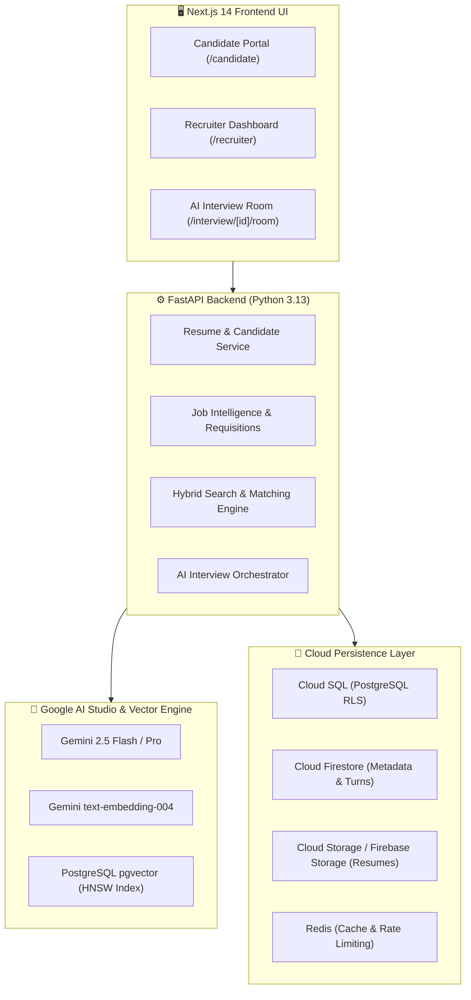

# 🚀 Hiring AI — Enterprise Multi-Tenant AI Recruitment & Live Interview Platform

An enterprise-grade, multi-tenant AI recruitment intelligence, hybrid candidate-job matching, and live adaptive interview platform powered by **Google Gemini (Google AI Studio)**, **Firebase Authentication**, **Google Cloud Firestore**, **Google Cloud SQL (PostgreSQL + pgvector)**, **Google Cloud Storage (GCS)**, and **Google Cloud Run**.

---

## 🌟 Key Features

* **Multi-Version Resume Storage & Management**:
  * Secure PDF/DOCX binary storage in **Google Cloud Storage / Firebase Storage** with short-lived (15-min) v4 signed URLs.
  * Document metadata indexed in **Google Cloud Firestore**.
  * Candidates can upload multiple resume versions (`v1`, `v2`, `v3`) and bind specific versions immutably to job applications.
* **Hybrid Search & Zero-Hallucination Matching Engine**:
  * Combines **Sparse Lexical Search (BM25)** with **Dense Semantic Vector Search (`pgvector` HNSW 1536-dim)** using **Reciprocal Rank Fusion (RRF)**.
  * **Strict Evidence Grounding**: Every matched skill cites exact quotation from resume text. Uncited skills are flagged as `MISSING` (0 points), eliminating AI hallucinations.
  * **Deterministic 8-Dimension Scoring Formula**: Math-based scoring (Skills 30%, Responsibilities 20%, Experience 15%, Alignment 10%, Preferred 10%, Projects 10%, Education 5%).
* **Autonomous AI Interview System**:
  * Real-time multi-turn interview room with adaptive technical probing using **Google Gemini 2.5 Flash / Pro**.
  * Dynamic context injection (candidate resume + job requisition + conversation history).
  * Automated 4-pillar scorecard generation with evidence-backed evaluation.
* **Recruiter 6-Point Security Authorization Gate**:
  * Strict RBAC preventing cross-tenant access and unauthorized candidate resume downloads.
  * In-app secure PDF viewer modal with signed stream rendering.
* **Multi-Tenant Row-Level Security (RLS)**:
  * PostgreSQL RLS isolation (`app.current_org_id`) guaranteeing mathematical separation between organizations.

---

## 🏛️ System Architecture



---

## 🌐 Cloud Resources & Live Services

| Component | Resource ID / Region | Endpoint / Status |
| :--- | :--- | :--- |
| **GCP Project** | `hiring-ai-507307` | Active |
| **Firebase Project** | `hiring-ai-4ae76` | Active |
| **Cloud Run Region** | `asia-south1` | Active |
| **Backend API** | `ai-interview-api` | `https://ai-interview-api-30597175496.asia-south1.run.app` |
| **Frontend Web** | `ai-interview-frontend` | `https://ai-interview-frontend-30597175496.asia-south1.run.app` |
| **Cloud SQL** | `hiring-ai-pg` | PostgreSQL 16 + `pgvector` extension |
| **Storage Bucket** | `hiring-ai-4ae76.appspot.com` | Private resume binary storage |

---

## 🚀 Local Development Quickstart

### Prerequisites
* **Python 3.11+** (Python 3.13 recommended)
* **Node.js 18+** & **npm**
* **PostgreSQL 15+** with `pgvector` extension installed
* **Google AI Studio API Key**

---

### 1. Backend Setup (FastAPI)

```bash
cd backend

# 1. Create and activate virtual environment
python3 -m venv .venv
source .venv/bin/activate

# 2. Install dependencies
pip install -r requirements.txt

# 3. Configure environment variables
cp .env.example .env
# Add your GEMINI_API_KEY and DATABASE_URL in .env

# 4. Run database migrations
alembic upgrade head

# 5. Start development server
python3 -m uvicorn app.main:app --host 127.0.0.1 --port 8000 --reload
```

* API Health Check: `http://127.0.0.1:8000/api/v1/health`
* Swagger Interactive Docs: `http://127.0.0.1:8000/docs`

---

### 2. Frontend Setup (Next.js 14)

```bash
cd frontend

# 1. Install dependencies
npm install

# 2. Configure environment
cp .env.example .env.local
# Set NEXT_PUBLIC_API_URL=http://localhost:8000

# 3. Start development server
npm run dev
```

* Frontend Web Application: `http://localhost:3000`

---

## 🧪 Testing & Verification

### Run Backend Test Suite (Pytest)
```bash
cd backend
pytest -v
```
* `tests/test_resume_storage_and_application_flow.py` (9 tests verifying multi-version upload, 10MB limits, recruiter 6-point gate)
* `tests/test_hybrid_search_matching.py` (4 tests verifying BM25 token scoring, pgvector cosine queries, and anti-hallucination citations)

### Run Frontend Test Suite (Vitest)
```bash
cd frontend
npm test
```

### Build Production Bundle
```bash
cd frontend
npm run build
```

---

## 🔒 Security & Anti-Hallucination Architecture

1. **Evidence Grounding Mandate**:
   ```json
   {
     "requirement_name": "PostgreSQL",
     "match_status": "EXACT",
     "evidence_snippet": "Designed high-throughput PostgreSQL database schema with RLS."
   }
   ```
   If no textual citation exists in the candidate's resume, the skill is classified as `MISSING` (0 points).
2. **Deterministic Math**: LLMs extract facts into strict Pydantic JSON schemas; scoring formulas are mathematically calculated in Python, not hallucinated by LLMs.
3. **Tenant Row-Level Security**: Every SQL query is automatically constrained by `app.current_org_id`.
4. **Short-Lived URLs**: All file downloads use 15-minute expiring signed URLs. Permanent public URLs are prohibited.

---

## 📚 Technical Documentation

For the complete architectural design, database schemas, and mathematical scoring models, refer to:
* **[ARCHITECTURE.md](./ARCHITECTURE.md)** — Comprehensive System Blueprint & Sequence Flows
* **[docs/](./docs/)** — Detailed API specifications and deployment guides
